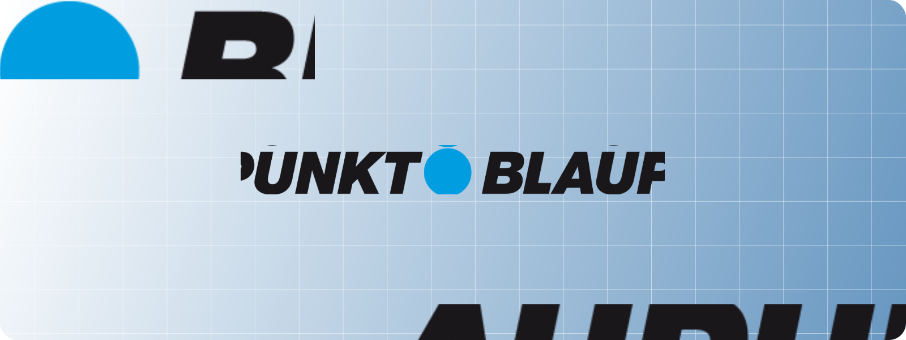

<div align="center">

<br><br>

<picture>
  <source srcset="./src/assets/Images/Readme/Header.svg">
  
</picture>

<br>

<strong>EV charging products, downloads, and support — in one multilingual hub.</strong>
<br />
<sub>Explore AC/DC stations, portable chargers, cables, and documentation for Blaupunkt customers.</sub>

<br><br>
  <a href="#">
    
  </a>
  <a href="#">
    
  </a>
  <a href="#">
    
  </a>
  <a href="#">
    
  </a>

<br>

<a href="docs/DOCUMENTATION.md">📖 Documentation</a> ·
<a href="docs/QUICKSTART.md">⚡ Quick Start</a> ·
<a href="docs/FEATURES.md">🛠️ Features</a>

</div>

<br />

<div align="center">
  
</div>

<br />

---

## ✨ Why this project?

This repository powers the Blaupunkt EV charging site, bringing product catalogs, downloads, and contact options together in a single, localized experience.

> 🌍 Multi-language catalog · ⚡ AC/DC charging portfolio · 📄 Downloadable specs · 📬 Contact with Graph API backend

---

## 🚀 Core highlights

- Product-first experience for AC/DC stations, super-fast chargers, portable units, and cables
- Localization-ready App Router setup with `next-intl`
- Data-driven product configs for specs, assets, and downloads
- Tailwind CSS v4 with modern Next.js 16 runtime
- Contact workflows handled by a Next.js API route using the Resend email API
- Optimized images and assets for fast page delivery

See more in [docs/FEATURES.md](docs/FEATURES.md).

---

## 🛠️ Tech stack

<div align="center">


</div>

- Next.js 16 (App Router) with React 19
- Tailwind CSS 4, PostCSS
- `next-intl` for routing and translations
- Framer Motion for animations
- PDF generation/download helpers (`pdf-lib`, `file-saver`)
- PHP endpoints for contact handling (under `public/api`)

---

## 📦 Installation & usage

This app runs with Node 18+ (Next.js 16). `pnpm` is recommended.

```bash
git clone https://github.com/incial/Blaupunkt-Main.git
cd Blaupunkt-Main
pnpm install

# Development
pnpm dev

# Production build
pnpm build
pnpm start
```


#

## 📄 License

This project is licensed under the MIT License — see [LICENSE](LICENSE).

---

<div align="center">
	**Built with care for the Blaupunkt EV community**

<br>

	⭐ Star the repo if you find it helpful!
</div>
